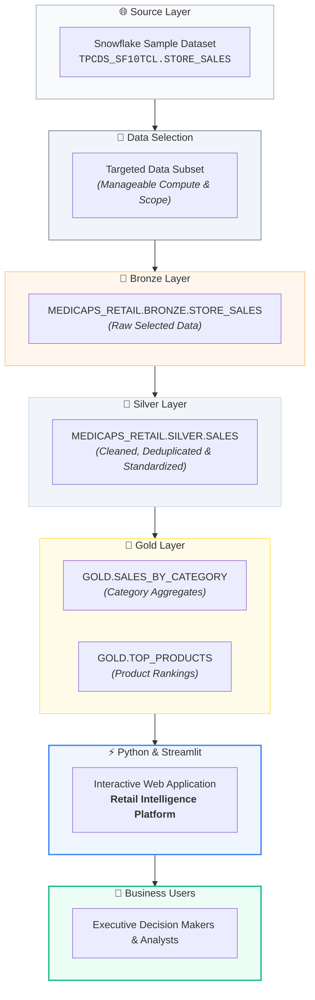
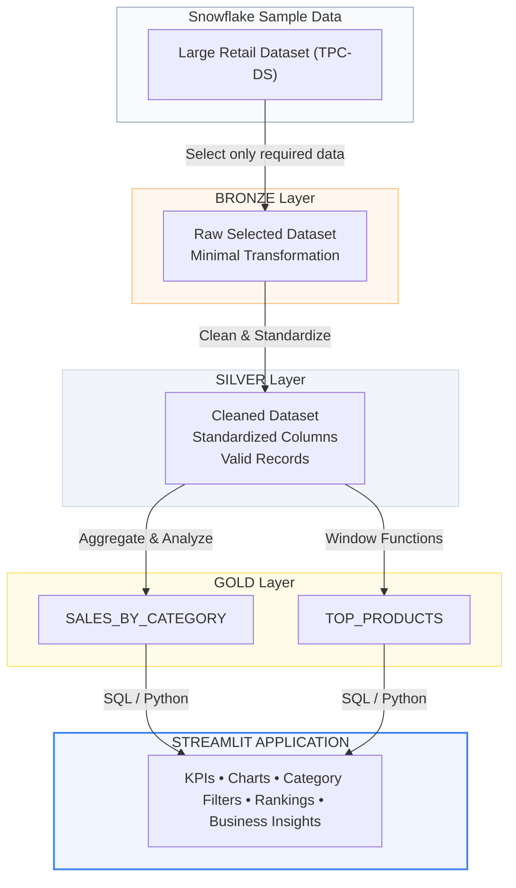
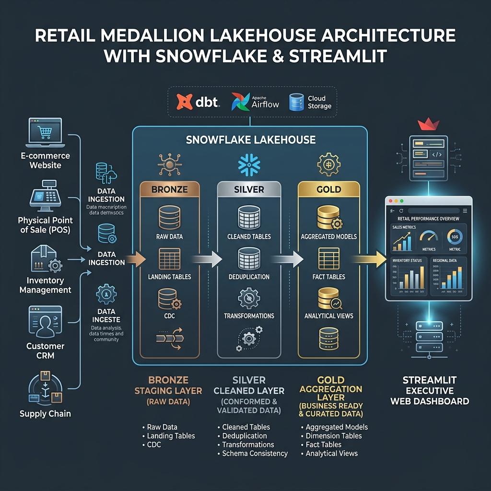
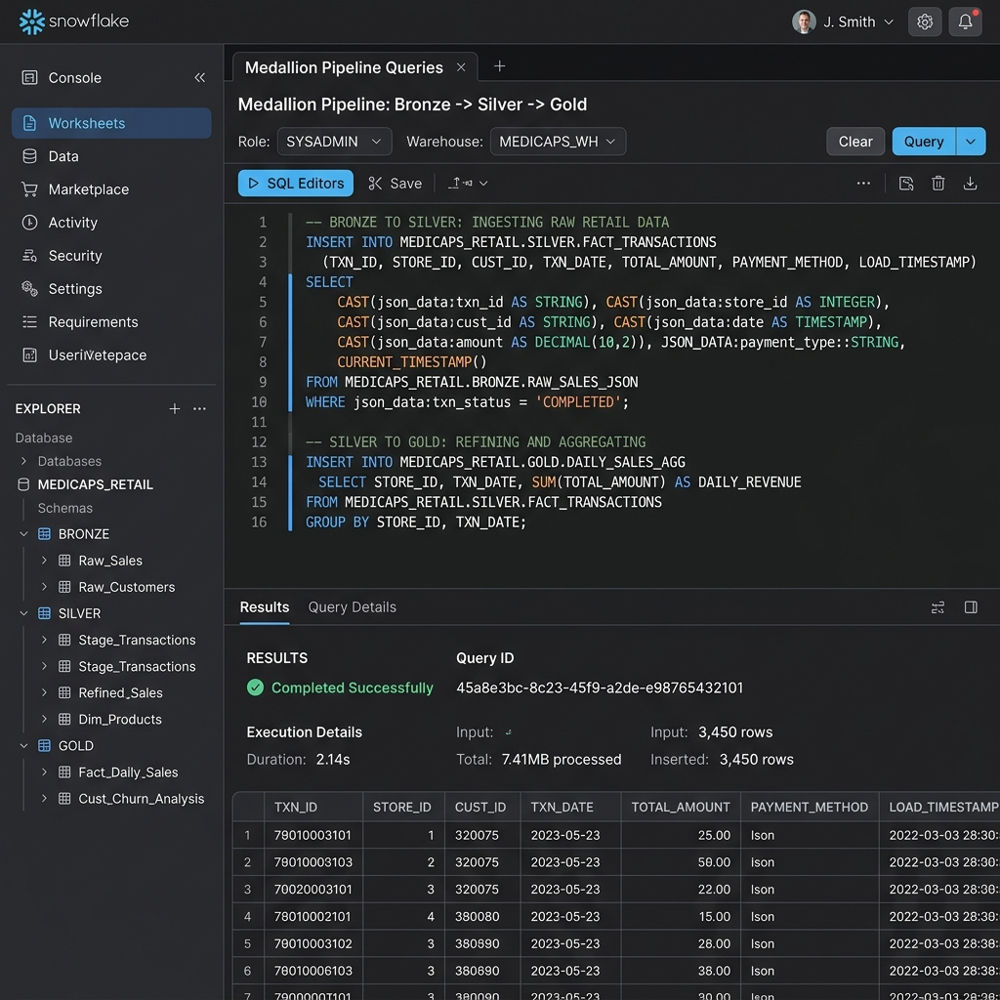
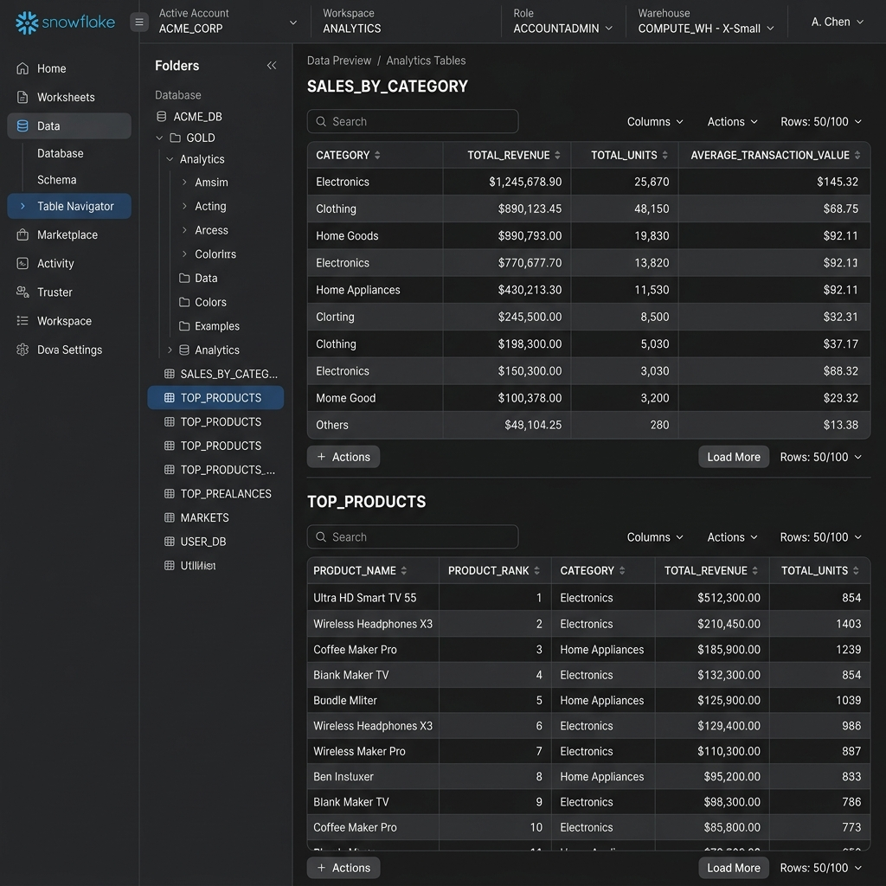
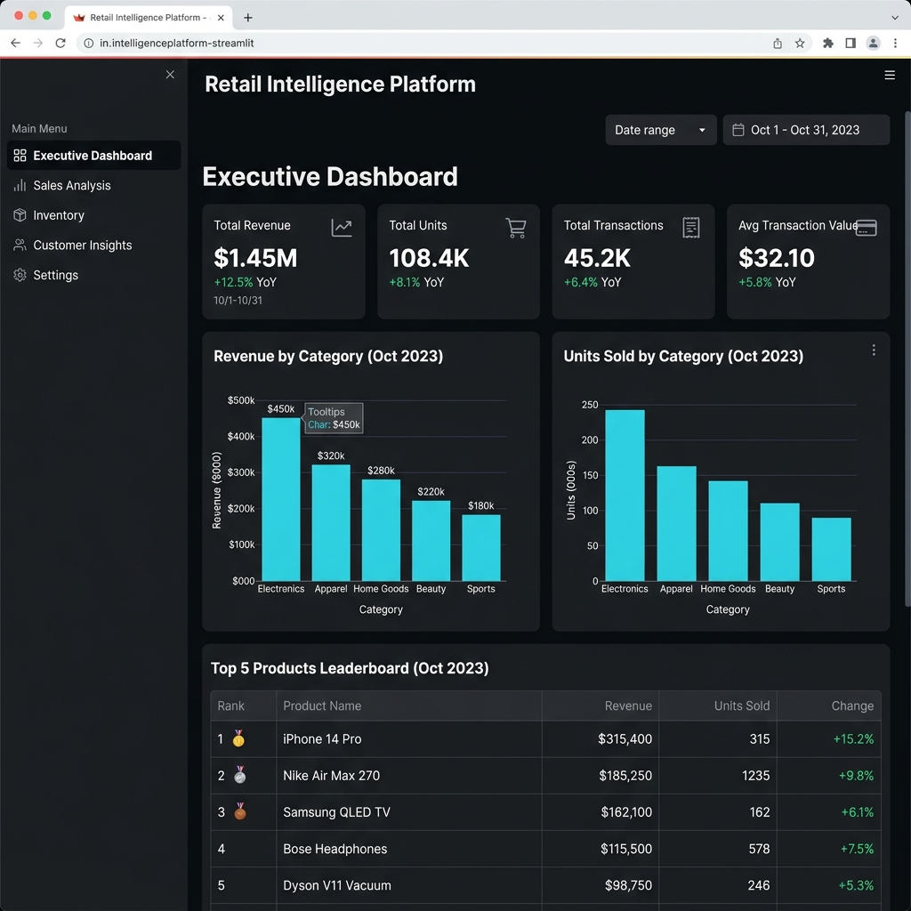

# 🛒 Retail Intelligence Platform

> An end-to-end data analytics project built using Snowflake, SQL, VS Code, Python, Streamlit, and Medallion Architecture.

---

> 💡 **Project Story & Recruiter Perspective**
> 
> *"Don't think of this README as documentation written just because GitHub expects a README. Think of it as the **story of your project**.*
>
> *If a recruiter opens your repository, they should understand in two minutes:  
> **What was the problem? → Where did the data come from? → How did you process it? → Why Bronze/Silver/Gold? → What SQL did you use? → How did you turn it into an application?***
>
> *That's what makes this look like a **true data engineering project**, rather than just a collection of SQL queries."*

---

## 📌 Project Overview

The **Retail Intelligence Platform** is a mini end-to-end data engineering and analytics project designed to demonstrate how a large-scale retail dataset can be transformed into business-ready insights and exposed through an interactive application.

The project uses a large retail dataset available through Snowflake's sample data environment.

Instead of processing the entire dataset, the project intentionally extracts and processes only a relevant subset of the available data.

The selected data is then processed through a simplified **Medallion Architecture**:



---

## 🎯 Business Problem

Large retail organizations generate huge volumes of transactional data. However, raw transactional data is not directly useful to business users.

Business teams typically want answers to questions such as:

- **What categories generate the most revenue?**
- **Which products are performing best?**
- **How many units are being sold?**
- **What is the average transaction value?**
- **Which products are the top performers within each category?**
- **What trends can be identified from the available data?**

The objective of this project is to create a small analytical data platform that transforms raw retail transaction data into business-ready information and presents the results through an interactive application.

---

## 🏗️ Overall Architecture



---

## ☁️ Technology Stack

| Technology | Purpose |
| :--- | :--- |
| **Snowflake** | Cloud data platform and high-performance data processing |
| **Snowflake Sample Data** | Source retail dataset (`TPCDS_SF10TCL`) |
| **SQL** | Data exploration, transformation, modeling, and analytics |
| **VS Code** | Local development environment |
| **Python** | Application backend and Snowflake integration |
| **Pandas** | In-memory data manipulation and reshaping |
| **Streamlit** | Interactive web application framework |
| **Plotly** | Interactive visualizations and charts |
| **Git / GitHub** | Version control and portfolio hosting |
| **Antigravity** | AI-assisted application development |

---

## 📊 Source Dataset

The project uses retail sample data available through Snowflake's sample data environment (`SNOWFLAKE_SAMPLE_DATA.TPCDS_SF10TCL.STORE_SALES`).

The source dataset is intentionally large to simulate a real-world analytical environment.

### 💡 Important Design Decision

We do not process the entire source dataset.

```text
Large Dataset ──> Understand Requirement ──> Select Relevant Data ──> Process Manageable Subset
```

This demonstrates an important data engineering principle:

> **"More data does not automatically mean better analysis. Process the data required to solve the business problem."**

Processing only the required subset also helps reduce unnecessary compute usage and keeps the classroom project manageable.

---

## 🥉 Bronze Layer

### Purpose
The Bronze layer contains the selected source data with minimal transformation.

The objective is to create a working copy of the relevant portion of the source dataset without immediately performing extensive business transformations.

```text
Snowflake Sample Dataset ──> Select subset ──> BRONZE
```

### Example SQL (`sql/bronze.sql`)
```sql
CREATE OR REPLACE TABLE MEDICAPS_RETAIL.BRONZE.STORE_SALES AS
SELECT *
FROM SNOWFLAKE_SAMPLE_DATA.TPCDS_SF10TCL.STORE_SALES
LIMIT 500000;
```

### Why Bronze?
Bronze provides a controlled starting point for downstream processing. It allows us to cleanly separate:
1. Source data ingestion
2. Data cleaning
3. Business transformations
4. Analytical reporting

---

## 🥈 Silver Layer

### Purpose
The Silver layer contains cleaned and standardized data.

Typical Silver transformations include:
- Selecting required columns
- Renaming columns to intuitive business names
- Removing invalid records (`QUANTITY > 0` and valid dates)
- Standardizing data types
- Handling basic data-quality issues
- Preparing data for downstream analytical aggregation

### Example SQL (`sql/silver.sql`)
```sql
CREATE OR REPLACE TABLE MEDICAPS_RETAIL.SILVER.SALES AS
SELECT
    SS_SOLD_DATE_SK    AS DATE_KEY,
    SS_ITEM_SK         AS ITEM_KEY,
    SS_STORE_SK        AS STORE_KEY,
    SS_CUSTOMER_SK     AS CUSTOMER_KEY,
    SS_QUANTITY        AS QUANTITY,
    SS_SALES_PRICE     AS SALES_PRICE,
    SS_EXT_SALES_PRICE AS TOTAL_SALES
FROM MEDICAPS_RETAIL.BRONZE.STORE_SALES
WHERE SS_QUANTITY > 0;
```

---

## 🥇 Gold Layer

### Purpose
The Gold layer contains business-ready data.

Unlike Bronze and Silver, Gold is designed around **business questions** rather than simply storing or cleaning source records.

```text
GOLD
├── SALES_BY_CATEGORY
└── TOP_PRODUCTS
```

### 📈 Gold Table: `SALES_BY_CATEGORY`
Summarizes sales performance by product category / item:
- Total revenue
- Total units
- Total transactions
- Average transaction value

```sql
CREATE OR REPLACE TABLE MEDICAPS_RETAIL.GOLD.SALES_BY_CATEGORY AS
SELECT
    CATEGORY,
    SUM(TOTAL_SALES) AS TOTAL_REVENUE,
    SUM(QUANTITY) AS TOTAL_UNITS,
    COUNT(*) AS TOTAL_TRANSACTIONS,
    AVG(TOTAL_SALES) AS AVERAGE_TRANSACTION_VALUE
FROM MEDICAPS_RETAIL.SILVER.SALES
GROUP BY CATEGORY
ORDER BY TOTAL_REVENUE DESC;
```

### 🏆 Gold Table: `TOP_PRODUCTS`
Identifies high-performing merchandise and demonstrates the use of **SQL Window Functions**:

```sql
SELECT
    PRODUCT_NAME,
    CATEGORY,
    REVENUE,
    PRODUCT_RANK
FROM
(
    SELECT
        PRODUCT_NAME,
        CATEGORY,
        SUM(TOTAL_SALES) AS REVENUE,
        DENSE_RANK() OVER (
            PARTITION BY CATEGORY
            ORDER BY SUM(TOTAL_SALES) DESC
        ) AS PRODUCT_RANK
    FROM MEDICAPS_RETAIL.GOLD.SALES_ANALYTICS
    GROUP BY
        PRODUCT_NAME,
        CATEGORY
)
WHERE PRODUCT_RANK <= 3;
```

> **Business Question Answered:** *"What are the top three products within every category?"*

---

## 🧠 SQL Concepts Demonstrated

- **Basic SQL**: `SELECT`, `WHERE`, `ORDER BY`, `LIMIT`
- **Aggregations**: `SUM()`, `AVG()`, `COUNT()`
- **Grouping**: `GROUP BY`
- **Joins**: `INNER JOIN`, `LEFT JOIN`
- **Subqueries & CTEs**: Creating intermediate analytical results
- **Window Functions**: `DENSE_RANK()`, `PARTITION BY`, `ORDER BY` inside `OVER()`
- **Data Transformation**: Column aliasing, filtering invalid transactions, revenue metrics

---

## 🤖 AI-Assisted Development

**Antigravity** was used as an AI-assisted development environment to help generate and refine the application code.

```text
Human (Business Requirement) 
  ↓
Architecture (Technical Design)
  ↓
SQL / Data Model (Gold Tables)
  ↓
AI-Assisted Development (Antigravity IDE)
  ↓
Python / Streamlit Application
```

AI was not treated as a replacement for understanding the architecture; rather, it was used as a rapid development assistant to ensure best practices in code quality and security.

---

## 💻 Project Structure

```text
retail-intelligence/
│
├── README.md               # Project narrative & portfolio documentation
├── app.py                  # Streamlit application with interactive UI & charts
├── requirements.txt        # Python dependency manifest
├── .env.example            # Environment variables template
├── .gitignore              # Protects secrets (.env) and cache from Git
│
├── sql/
│   ├── bronze.sql          # Raw ingestion staging table DDL & insert
│   ├── silver.sql          # Cleaned & standardized sales fact model
│   ├── gold.sql            # Aggregated business marts & window functions
│   └── analytics.sql       # Business analytics queries
│
└── screenshots/
    ├── architecture.png    # Medallion Lakehouse architecture diagram
    ├── snowflake.png       # Snowflake worksheets & schema console
    ├── gold.png            # Gold layer tables preview
    └── dashboard.png       # Streamlit executive dashboard UI
```

---

## 🔐 Security

Snowflake credentials should **never** be hard-coded inside Python files. Environment variables are used instead.

```ini
SNOWFLAKE_ACCOUNT=your_account
SNOWFLAKE_USER=your_username
SNOWFLAKE_PASSWORD=your_password
SNOWFLAKE_WAREHOUSE=COMPUTE_WH
SNOWFLAKE_DATABASE=MEDICAPS_RETAIL
SNOWFLAKE_SCHEMA=GOLD
```

The `.env` file is excluded in `.gitignore`:
```text
.env
__pycache__/
*.pyc
.venv/
```

---

## 📱 Streamlit Application

The final application provides a business-facing interface over the Gold layer:

- **Executive KPI Cards**: Total Revenue, Total Units Sold, Total Transactions, and Average Transaction Value.
- **Interactive Visualizations**: Revenue by category, units sold by category (sorted descending).
- **Product Leaderboard**: Category drill-down with Top 3, Top 5, or Top 10 rankings and badges (🥇, 🥈, 🥉, 4️⃣, 5️⃣).
- **Automated Business Insights**: Automatically highlights top-revenue category, top-volume category, top-selling product, and basket spend.
- **Side Controls**: Category filters, connection status indicator, and dynamic cache refresh.

---

## 🔄 End-to-End Data Flow

```text
SOURCE ──> Snowflake Sample Dataset ──> Select Required Data ──> BRONZE ──> Clean + Standardize ──> SILVER ──> Aggregate & Window Functions ──> GOLD ──> SQL / Python ──> STREAMLIT ──> END USER
```

---

## 🎯 Business Questions Answered

1. **Which product categories generate the most revenue?**
2. **Which categories sell the most units?**
3. **What is the average transaction value?**
4. **Which products are the top performers?**
5. **What are the top three products within each category?**
6. **Which category has the highest revenue?**
7. **Which category has the highest transaction volume?**

---

## 📌 Why We Did Not Process the Entire Dataset

A major design decision in this project was to avoid processing the complete large-scale source dataset. The purpose was to demonstrate the thought process of a data engineer:

```text
Business Requirement ──> Identify Required Data ──> Filter Relevant Records ──> Transform Only What Is Needed ──> Create Business-Ready Data
```

**Key Advantages:**
- Lower unnecessary compute costs
- Faster development and experimentation
- Easier debugging
- Focused business analysis

---

## 🏗️ Why Medallion Architecture?

| Layer | Purpose | Example |
| :--- | :--- | :--- |
| 🥉 **Bronze** | Raw/selected source data | Selected sales records staging |
| 🥈 **Silver** | Cleaned and standardized data | Validated sales transactions |
| 🥇 **Gold** | Business-ready data | `SALES_BY_CATEGORY`, `TOP_PRODUCTS` |

This separation makes the pipeline easier to **understand**, **maintain**, **debug**, **extend**, and **reuse**.

---

## 💡 Key Learning Outcomes

Through this project, we demonstrate:
- Working with a cloud data platform (Snowflake)
- Exploring and selecting manageable subsets from large datasets
- Designing a Medallion Architecture (Bronze, Silver, Gold)
- Writing analytical SQL with aggregations and window functions (`DENSE_RANK()`)
- Connecting Python to Snowflake securely with environment variables
- Building an interactive executive dashboard with Streamlit and Plotly
- Managing credentials securely and avoiding data leaks
- Structuring a professional GitHub portfolio project

---

## 🚀 Future Improvements

- Incremental data loading with Snowflake Streams & Tasks
- Dynamic Tables & dbt transformations
- Automated data quality testing (Great Expectations / dbt test)
- CI/CD pipeline automation with GitHub Actions
- Role-based access control (RBAC) in Snowflake
- Cloud deployment (Streamlit Community Cloud / AWS ECS)

---

## 📸 Project Screenshots

| Architecture | Snowflake Console |
| :---: | :---: |
|  |  |
| **Gold Schema Preview** | **Streamlit Executive Dashboard** |
|  |  |

---

## 👨‍💻 Author

**Gnath**  
*Student Project — Data Engineering / SQL / Cloud Analytics*

---

## ⭐ Final Takeaway

Data engineering is not simply about writing SQL queries. The complete lifecycle is:

```text
DATA ──> UNDERSTAND ──> SELECT ──> TRANSFORM ──> MODEL ──> ANALYZE ──> BUILD ──> DELIVER
```

The ultimate goal is turning large-scale raw data into actionable intelligence that empowers decision makers.

---

## 📜 Disclaimer

*This project was created for educational and portfolio purposes using Snowflake sample data. The architecture is a simplified representation of a real-world enterprise data platform designed to be achievable and impactful within a portfolio.*
