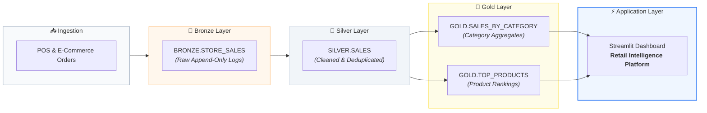

# 🛍️ Retail Intelligence Platform

A portfolio-quality, interactive analytics dashboard built with **Python**, **Streamlit**, **Snowflake**, **Pandas**, and **Plotly**. 

This application connects securely to Snowflake using environment variables to visualize and extract actionable business insights from the **Medallion Architecture** Gold layer (`MEDICAPS_RETAIL.GOLD`).

---

## 📁 Project Structure

```
retail-intelligence/
├── .env.example            # Environment variables template for Snowflake
├── .gitignore              # Protects secrets (.env) and cache from Git
├── requirements.txt        # Python dependency manifest
├── snowflake_db.py         # Modular Snowflake connector, queries & mock data fallback
├── app.py                  # Streamlit application with interactive UI & charts
└── README.md               # Setup and execution guide
```

---

## 🏛️ Medallion Data Architecture



The application queries two pre-aggregated Gold layer tables in the `MEDICAPS_RETAIL` database:

1. **`MEDICAPS_RETAIL.GOLD.SALES_BY_CATEGORY`**
   - `CATEGORY`
   - `TOTAL_REVENUE`
   - `TOTAL_UNITS`
   - `TOTAL_TRANSACTIONS`
   - `AVERAGE_TRANSACTION_VALUE`

2. **`MEDICAPS_RETAIL.GOLD.TOP_PRODUCTS`**
   - `PRODUCT_NAME`
   - `CATEGORY`
   - `REVENUE`
   - `PRODUCT_RANK`

---

## 🚀 Quickstart Guide

### 1. Prerequisites
- Python 3.9+ installed
- Access to a Snowflake account with `MEDICAPS_RETAIL` database

---

### 2. Install Dependencies

It is recommended to use a virtual environment:

```bash
# Create virtual environment
python -m venv .venv

# Activate virtual environment
# On Windows (PowerShell):
.venv\Scripts\Activate.ps1
# On macOS/Linux:
source .venv/bin/activate

# Install required packages
pip install -r requirements.txt
```

---

### 3. Configure Environment Variables (`.env`)

1. Copy `.env.example` to create `.env`:
   ```bash
   cp .env.example .env
   ```
2. Open `.env` and fill in your Snowflake credentials:
   ```ini
   SNOWFLAKE_ACCOUNT=your_account_identifier
   SNOWFLAKE_USER=your_username
   SNOWFLAKE_PASSWORD=your_password
   SNOWFLAKE_WAREHOUSE=COMPUTE_WH
   SNOWFLAKE_DATABASE=MEDICAPS_RETAIL
   SNOWFLAKE_SCHEMA=GOLD
   ```

> **Security Note:** `.env` is listed in `.gitignore` and will never be committed to source control.

---

### 4. Run the Streamlit Application

Launch the dashboard:

```bash
streamlit run app.py
```

The application will open in your default browser at `http://localhost:8501`.

---

## 🌟 Key Features

- **Executive KPI Cards**: Real-time aggregation of Total Revenue, Total Units Sold, Total Transactions, and Average Transaction Value.
- **Interactive Plotly Visualizations**: Responsive horizontal bar charts for revenue and units sold by category, sorted descending.
- **Top 3 Products Leaderboard**: Interactive product drill-down with rank badges (🥇, 🥈, 🥉) and formatted revenue.
- **Automated Business Insights**: Automatically detects highest-revenue category, highest-volume category, top product, and ATV.
- **Query Caching**: Uses `@st.cache_data(ttl=600)` to optimize performance and minimize Snowflake warehouse compute credits.
- **Graceful Error Handling**: Detects connection errors or missing credentials with helpful diagnostics and built-in sample data fallback for seamless testing.
